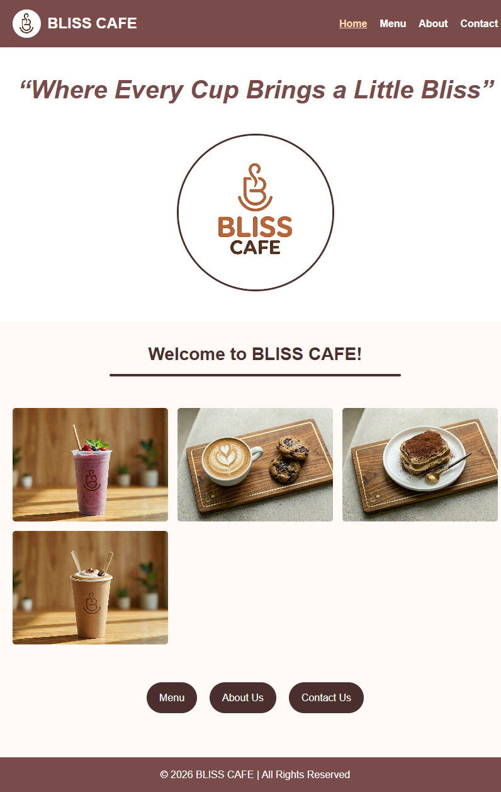
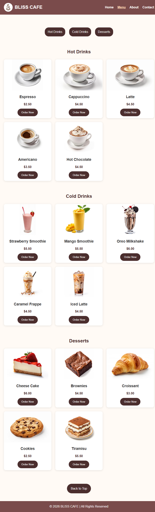
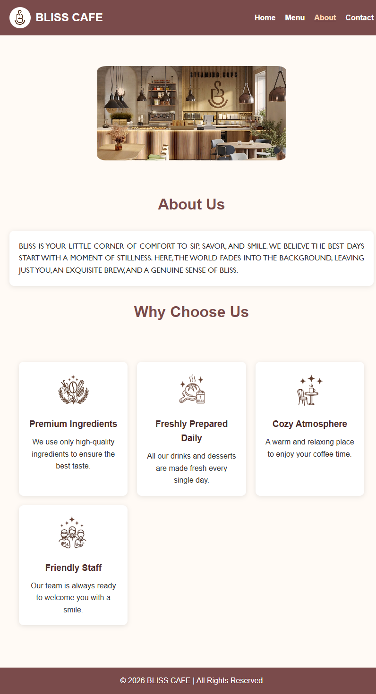
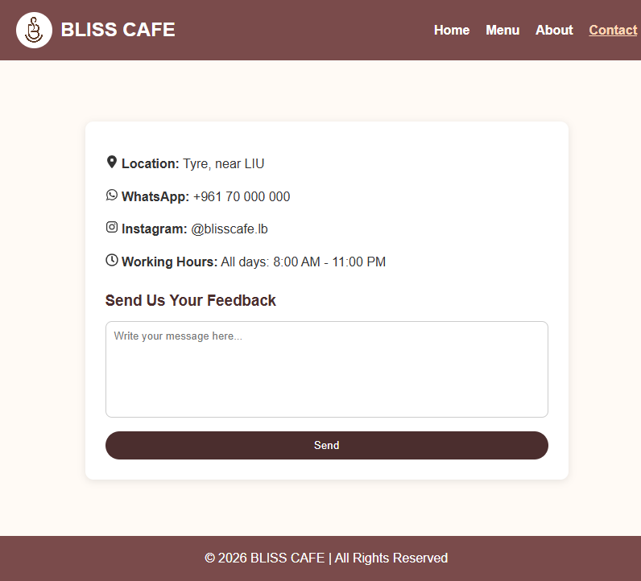

# BLISS CAFE ☕

## Project Description

BLISS CAFE is a responsive café website developed using ReactJS. It allows users to browse the café menu, learn about the café, view contact information, and simulate placing an order. The website provides a clean, modern, and user-friendly interface that works well on both desktop and mobile devices.

## Features

- Responsive design for desktop and mobile devices
- Home page with welcome section and image gallery
- Menu page with hot drinks, cold drinks, and desserts
- Order Now popup notification
- About Us page
- Contact page with:
  - Location
  - WhatsApp
  - Instagram
  - Working hours
  - Feedback form
- Navigation bar
- Reusable Header and Footer components

## Technologies Used

- ReactJS
- React Router DOM
- CSS
- HTML
- JavaScript
- Vite

## Setup Instructions

1. Clone the repository

git clone https://github.com/ZnbH207/bliss-cafe.git

2. Open the project folder

cd bliss-cafe

3. Install dependencies

npm install

4. Start the development server

npm run dev

5. Open your browser and visit

http://localhost:5173

## Screenshots

### Home Page

### Menu Page

### About Page

### Contact Page

## Live Website

Add your Vercel link here:

(https://bliss-cafe-six.vercel.app/)

## Author

Zainab
